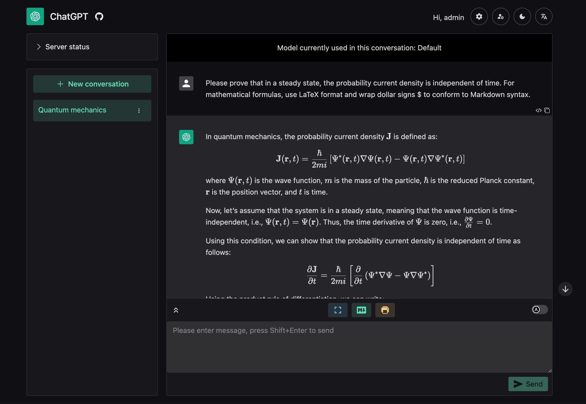

# ChatGPT Web Share

A web application that allows multiple users to share a ChatGPT account at the same time, developed using FastAPI and Vue3. It can be used for sharing or renting a ChatGPT account among friends. It supports ChatGPT Plus, setting conversation models, and user request limits.

This readme was translated by ChatGPT.

## About the project

ChatGPT Web Share (CWS for short) is designed to share a ChatGPT Plus account with multiple users. CWS:
- is a front-end and back-end separated application, so you need to deploy the back-end to a stable and reliable server with a fixed IP address by yourself
- is used to share a ChatGPT Plus account, not the official API
- uses the unofficial ChatGPT API, which prioritizes support for ChatGPT Plus accounts

## Features

- A beautiful and concise web interface using [naive-ui](https://www.naiveui.com/)
  - Supports multiple languages
  - Supports switching to dark mode
  - Supports copying reply content or code content with one click
  - Supports displaying images, tables, mathematical formulas, and syntax highlighting in replies
  - **Supports exporting conversations as beautiful Markdown or PDF files**
  - Dynamically displays reply content
  - Supports stopping generating replies
- Multiple users can share the same ChatGPT account
  - Different users' ChatGPT conversations are separated and do not affect each other
  - When multiple users request at the same time, they will be queued for processing
  - Administrators can set users' maximum number of conversations, conversation time limits, etc.
  - Provides real-time updated service usage status to avoid usage peaks
- Comprehensive management functions
  - Modify user conversation restrictions
  - Manage conversations/view member conversation records/assign conversations to specific users
  - View logs in real-time
  - Record request and conversation statistics

## User Guide

Please see the WIKI: [English Guide](https://github.com/moeakwak/chatgpt-web-share/wiki/English-Guide)

## Usage Statement

### Information Collection and Privacy Statement

Starting from version v0.2.16, this project uses Sentry to collect error information. By using this project, you agree to the Sentry privacy policy. Any anonymous information collected through Sentry will only be used for development and debugging purposes. We will never collect or store any of your private data, like username, password, access token, etc.

If you do not want to be tracked by Sentry, you can set the environment variable `VITE_DISABLE_SENTRY` to "yes" before building the front-end.

### Risk Statement

This project is for learning and research purposes only, and commercial use is not encouraged. We are not responsible for any losses caused by using this project.