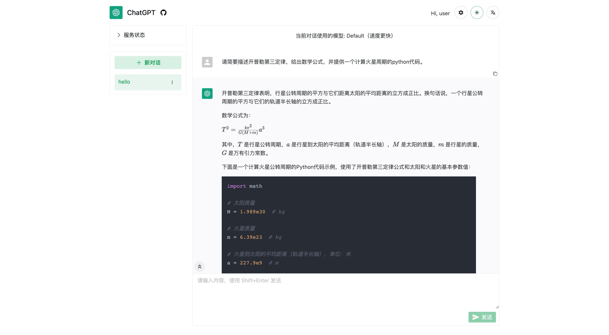

# ChatGPT Web Share

[](https://github.com/moeakwak/chatgpt-web-share/pkgs/container/chatgpt-web-share)
[](https://github.com/moeakwak/chatgpt-web-share/actions)
[](https://github.com/moeakwak/chatgpt-web-share/blob/main/LICENSE)

[English Readme](README.en.md)

共享一个 ChatGPT 账号给多用户同时使用的 web 应用，使用 FastAPI + Vue3 开发。可用于朋友之间共享或合租 ChatGPT 账号。支持 ChatGPT Plus / 设置对话模型 / 用户请求限制等功能。支持使用 GPT-4！



通知/讨论 Channel：https://t.me/chatgptwebshare

## 特点

- 美观简洁的 web 界面，使用 [naive-ui](https://www.naiveui.com/)
  - 支持多语言
  - 切换夜间模式
  - 支持一键复制回复内容或代码内容
  - 支持显示回复中的图像/表格/数学公式/语法高亮
  - **支持导出对话为美观的 Markdown 或 PDF 文件**
  - 动态显示回复内容
- 丰富的对话功能
  - **支持 GPT-4！** 🥳
  - 使用 unofficial ChatGPT API，优先支持 ChatGPT Plus 账号
- 多用户共享管理
  - 创建多用户用于共享一个 ChatGPT 账号
  - 不同用户创建的 ChatGPT 对话互相分隔，不会相互影响
  - 多用户同时请求时，会进行排队处理
  - 管理员可设置用户的最大对话数量、对话次数限制等
  - 提供实时更新的服务使用状态，从而能够避开使用高峰
- 完善的管理功能
  - 修改用户对话限制
  - 管理对话/查看成员对话记录/分配对话给特定用户
  - 实时查看日志

## 使用 Proxy 绕过 Cloudflare 验证

注意：当前使用 [revChatGPT](https://github.com/acheong08/ChatGPT)，使用其反向代理绕过 Cloudflare 验证，因而受到请求限制，并且不保证长期稳定性。此外，[OpenAI 可能会封禁使用 V1 Proxy 的账号](https://github.com/acheong08/ChatGPT/issues/1158)。

如果你有 Plus 账号，强烈建议使用 [自定义 Proxy](https://github.com/acheong08/ChatGPT-Proxy-V4)。该代理程序现在已经整合到了 docker 镜像中。如果你使用的是 docker 部署，根据下方的说明进行设置即可。

## 部署

### 使用 docker

推荐使用 docker-compose 部署。新建 `docker-compose.yml` 文件，内容如下：

```yaml
version: "3"

services:
  chatgpt-share:
    image: ghcr.io/moeakwak/chatgpt-web-share:latest
    container_name: chatgpt-web-share
    restart: always
    network_mode: bridge
    ports:
      - 8080:80 # web 端口号
    volumes:
      - ./data:/data # 存放数据库文件
      - ./config.yaml:/app/backend/api/config/config.yaml # 后端配置文件
      - ./logs:/app/logs # 存放日志文件
```

在同文件夹下创建 config.yaml，内容如下：

```yaml
print_sql: false
host: "127.0.0.1"
port: 8000
database_url: "sqlite+aiosqlite:////data/database.db"
run_migration: false

jwt_secret: "你的 jwt secret" # 用于生成 jwt token，需要自行设置
jwt_lifetime_seconds: 86400
cookie_max_age: 86400 # 登录过期时间
user_secret: "你的 user secret" # 用于生成用户密码，需要自行设置

sync_conversations_on_startup: true # 是否在启动时同步同步 ChatGPT 对话，建议启用
create_initial_admin_user: true # 是否创建初始管理员用户
create_initial_user: false # 是否创建初始普通用户
initial_admin_username: admin # 初始管理员用户名
initial_admin_password: password # 初始管理员密码
initial_user_username: user # 初始普通用户名
initial_user_password: password # 初始普通密码
ask_timeout: 600

chatgpt_access_token: "你的access_token" # 需要从 ChatGPT 获取
chatgpt_paid: true # 是否为 ChatGPT Plus 用户

log_dir: /app/logs  # 日志存储位置
console_log_level: DEBUG
```

`chatgpt_access_token` 获取方法：打开登录 chat.openai.com 后，打开 https://chat.openai.com/api/auth/session 并获取 accessToken 字段。

如果你是 Plus 用户，请增加如下配置到 `config.yaml` 中：

```yaml
chatgpt_base_url: http://127.0.0.1:6062/api/
run_reverse_proxy: true
reverse_proxy_port: 6062
reverse_proxy_binary_path: /app/backend/ChatGPT-Proxy-V4
reverse_proxy_puid: "_puid value from cookie"
```

其中，`reverse_proxy_puid` 需要从你的浏览器中获取：打开 https://chat.openai.com/，打开开发者工具，找到 cookie 中的 `_puid` 字段，将其值填入 `reverse_proxy_puid` 中。

`reverse_proxy_binary_path` 是反向代理服务的可执行文件路径，如果使用的是 Docker，它已经包含在镜像中的 `/app/backend/ChatGPT-Proxy-V4` 路径上。

`chatgpt_base_url` 也可以设置为其它反向代理服务的地址。如果启用 `run_reverse_proxy`，请确保 `chatgpt_base_url` 的端口匹配 `reverse_proxy_port`。

最后运行 `docker-compose up -d` 即可。

#### 更新版本

如要更新到最新版本，运行 `docker-compose pull` 以及 `docker-compose up -d` 即可。

### 使用 Caddy

#### 前端

需要先安装 nodejs 以及 pnpm，然后运行：

```bash
cd frontend
pnpm install
pnpm run build
```

#### 后端

需要先安装 poetry，并将 config.yaml 放置在 backend/api/config 目录下，然后运行：

```bash
cd backend
poetry install
poetry run python main.py
```

安装 caddy 后，新建 Caddyfile 文件，内容参考 [Caddyfile](Caddyfile)。

使用 `caddy start` 启动 caddy 即可。

## 调试信息收集和隐私声明

从版本 v0.2.16 开始，本项目使用 Sentry 来收集错误信息。使用本项目即表示您同意 Sentry 的隐私政策。通过 Sentry 收集的任何匿名信息仅用于开发和调试目的。我们永远不会收集或存储您的私人数据，如用户名、密码、access token 等。

如果不希望被 Sentry 追踪，可以在编译前端时将环境变量 VITE_DISABLE_SENTRY 设置为“yes”。设置后，前端将不会初始化 Sentry，从而不会上传任何信息。
