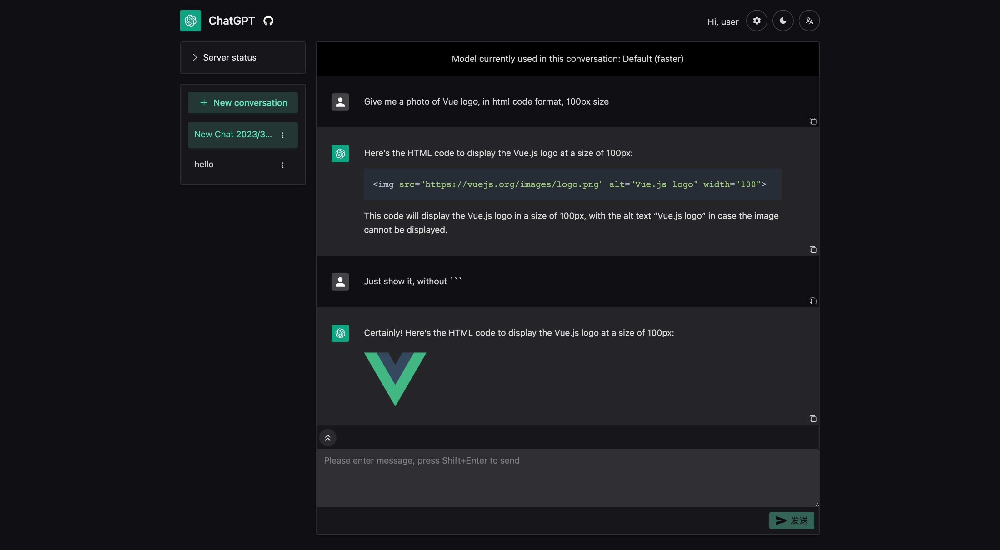

# ChatGPT Web Share


**中文 Readme 看这里: [README.zh.md](README.zh.md)**

A web application that allows multiple users to share a ChatGPT account at the same time, developed using FastAPI and Vue3. It can be used for sharing or renting a ChatGPT account among friends. It supports ChatGPT Plus, setting conversation models, and user request limits.

**3.15 Update: Version 0.2.0 supports GPT-4!** Now you can share a ChatGPT Plus account with your friends and use GPT-4 together.



This readme was translated by ChatGPT.

## Features

- Uses the unofficial ChatGPT API, supports ChatGPT Plus accounts
- **Supports GPT-4** 🥳
- Supports selecting which ChatGPT model to use (sha or paid or gpt-4, if is plus account)
- A beautiful and concise web interface using [naive-ui](https://www.naiveui.com/)
  - multiple languages
  - dark mode
  - copying reply content as Markdown format with one click
  - showing images/tables/formulas/syntax highlighting in replies
- Creates multiple users to share a ChatGPT account
- Different users' ChatGPT conversations are separated and do not affect each other
- When multiple users request at the same time, they will be queued for processing
- Administrators can set users' maximum number of conversations and conversation time limits, etc.

Note: Currently using [revChatGPT](https://github.com/acheong08/ChatGPT), which uses its reverse proxy to bypass Cloudflare verification, therefore it is subject to request limits and does not guarantee long-term stability.

## Deployment

### Using docker

It is recommended to use docker-compose for deployment. Create a new `docker-compose.yml` file with the following contents:

```yaml
version: "3"

services:
  chatgpt-share:
    image: ghcr.io/moeakwak/chatgpt-web-share:latest
    container_name: chatgpt-web-share
    restart: always
    network_mode: bridge
    ports:
      - 8080:80 # web port
    volumes:
      - ./data:/data # store database files
      - ./config.yaml:/app/backend/api/config/config.yaml   # backend config file
```

In the same folder, create config.yaml with the following contents:

Create a `config.yaml` file in the same directory with the following content:

```yaml
print_sql: false
host: "127.0.0.1"
port: 8000
database_url: "sqlite+aiosqlite:////data/database.db"

jwt_secret: "your jwt secret"    # Used for generating JWT token, needs to be set by yourself
jwt_lifetime_seconds: 86400
cookie_max_age: 86400           # Login expiration time
user_secret: "your user secret"  # Used for generating user password, needs to be set by yourself

sync_conversations_on_startup: true # Whether to synchronize ChatGPT conversations on startup, recommended to enable
create_initial_admin_user: true     # Whether to create initial admin user
create_initial_user: false          # Whether to create initial normal user
initial_admin_username: admin       # Initial admin username
initial_admin_password: password    # Initial admin password
initial_user_username: user         # Initial normal username
initial_user_password: password     # Initial normal password

chatgpt_access_token: "your access_token"    # Need to get from ChatGPT
chatgpt_paid: true  # Whether you are a ChatGPT Plus user
```

How to get `chatgpt_access_token`: After logging in to `chat.openai.com`, open https://chat.openai.com/api/auth/session and get the `accessToken` field.

Finally, run `docker-compose up -d`.

To upgrade, run `docker-compose pull` and `docker-compose up -d`.

### Using Caddy

#### Frontend

You need to install nodejs and pnpm first, then run:

```bash
cd frontend
pnpm install
pnpm run build
```

#### Backend

You need to install poetry first and place config.yaml in the backend/api/config directory, then run:

```bash
cd backend
poetry install
poetry run python main.py
```

After installing Caddy, create a new Caddyfile and refer to the [Caddyfile](Caddyfile) for its content.

Use `caddy start` to start Caddy.