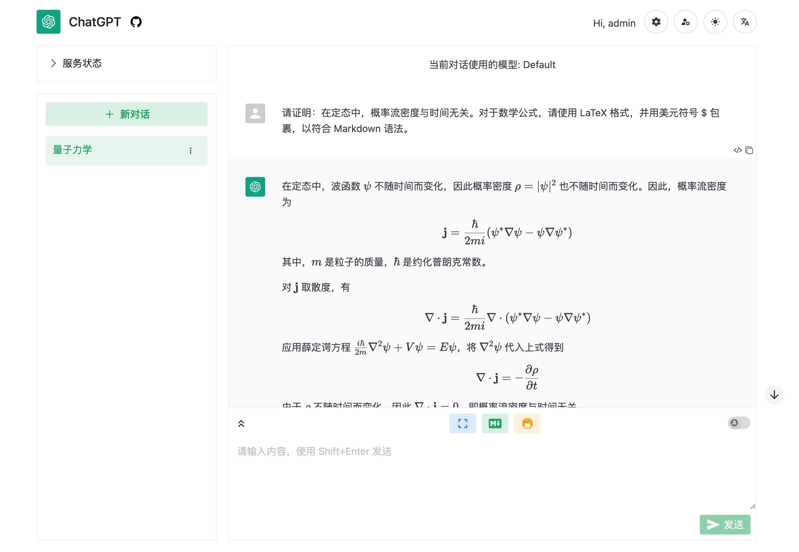

# ChatGPT Web Share

[English Readme](README.en.md)

共享一个 ChatGPT 账号给多用户同时使用的 web 应用，使用 FastAPI + Vue3 开发。可用于朋友之间共享或合租 ChatGPT 账号。支持 ChatGPT Plus / 设置对话模型 / 用户请求限制等功能。支持使用 GPT-4！

通知/讨论 Channel：https://t.me/chatgptwebshare

## 关于项目

ChatGPT Web Share (简称 CWS) 的目的是「共享」一个 ChatGPT Plus 账号给多个用户。CWS 是：
- 前后端分离的应用，因此你需要自行部署后端到一个稳定且 IP 可靠的服务器上
- 用于共享 ChatGPT Plus 账号，而不是官方 API
- 使用 unofficial ChatGPT API，优先支持 ChatGPT Plus 账号

## 特点

- 美观简洁的 web 界面，使用 [naive-ui](https://www.naiveui.com/)
  - 支持多语言
  - 切换夜间模式
  - 支持一键复制回复内容或代码内容
  - 支持显示回复中的图像/表格/数学公式/语法高亮
  - **支持导出对话为美观的 Markdown 或 PDF 文件**
  - 动态显示回复内容
  - 支持停止生成对话
- 多用户共享管理
  - 创建多用户用于共享一个 ChatGPT 账号
  - 不同用户创建的 ChatGPT 对话互相分隔，不会相互影响
  - 多用户同时请求时，会进行排队处理
  - 管理员可设置用户的最大对话数量、对话次数限制等
  - 提供实时更新的服务使用状态，从而能够避开使用高峰
- 完善的管理功能
  - 修改用户对话限制
  - 管理对话/查看成员对话记录/分配对话给特定用户
  - 实时查看日志
  - 记录请求及对话统计信息

## 使用指南

参见 WIKI：[中文指南](https://github.com/moeakwak/chatgpt-web-share/wiki/%E4%B8%AD%E6%96%87%E6%8C%87%E5%8D%97)

## 使用声明

### 调试信息收集和隐私声明

从版本 v0.2.16 开始，本项目使用 Sentry 来收集错误信息。使用本项目即表示您同意 Sentry 的隐私政策。通过 Sentry 收集的任何匿名信息仅用于开发和调试目的。我们永远不会收集或存储您的私人数据，如用户名、密码、access token 等。

如果不希望被 Sentry 追踪，可以在编译前端时将环境变量 VITE_DISABLE_SENTRY 设置为“yes”。设置后，前端将不会初始化 Sentry，从而不会上传任何信息。

### 风险声明

本项目仅供学习和研究使用，不鼓励用于商业用途。我们不对任何因使用本项目而导致的任何损失负责。
